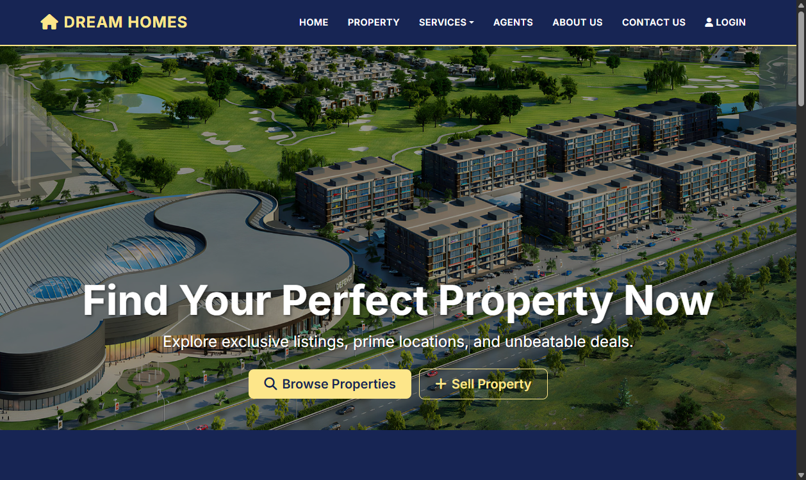
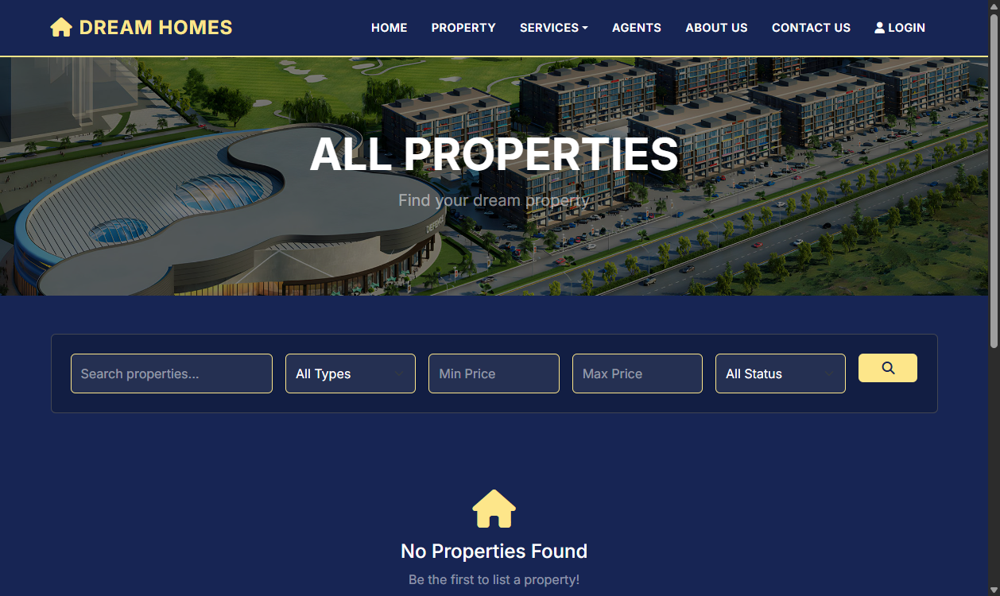
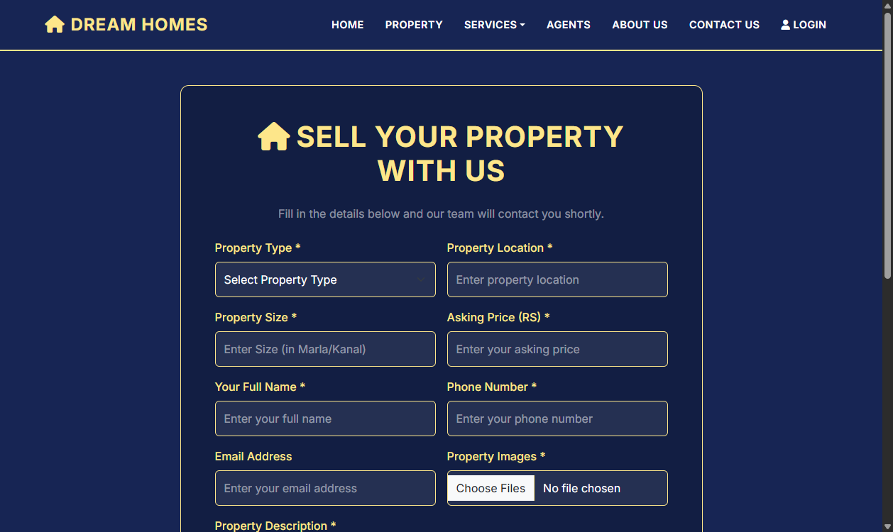
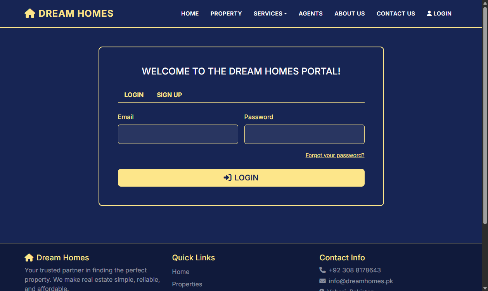
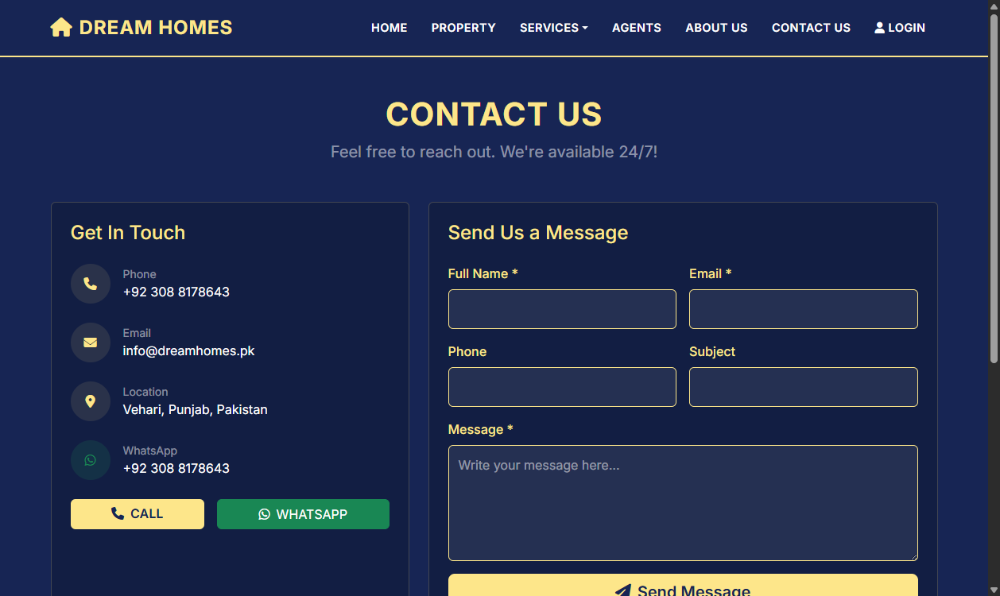

# 🏠 Real Estate Management System (Dream Homes)

A full-stack web application for managing property listings, bookings, and client interactions. Built with **Node.js**, **Express**, **MongoDB/Mongoose**, **EJS**, and **Bootstrap 5**.

---

## ✨ Key Features

- **Property Listings**: Add, edit, browse, and search properties with filters (price, location, type, status).
- **User Authentication**: Secure signup/login with **bcrypt** password hashing and **JWT** tokens.
- **Agent Management**: View and manage real estate agents.
- **Responsive UI**: Mobile-friendly design with **Bootstrap 5** and custom dark theme.
- **RESTful API**: Full CRUD endpoints for Users, Properties, and Agents.
- **Dynamic Views**: Server-side rendering with **EJS** templates.
- **Image Upload**: Property images upload with **Multer**.
- **Search & Filter**: Search properties by keyword, filter by type, price range, and status.

---

## 🛠 Tech Stack

| Layer | Technology |
|-------|-----------|
| **Frontend** | EJS Templates, Bootstrap 5, HTML5, CSS3, JavaScript |
| **Backend** | Node.js, Express.js |
| **Database** | MongoDB Atlas (Mongoose ODM) |
| **Authentication** | JSON Web Tokens (JWT), bcryptjs |
| **File Upload** | Multer |
| **Icons** | Font Awesome 6 |

---

## 📂 Project Structure

```
real-estate/
├── config/
│   └── db.js              # MongoDB connection
├── models/
│   ├── User.js            # User Mongoose schema
│   ├── Property.js        # Property Mongoose schema
│   └── Agent.js           # Agent Mongoose schema
├── routes/
│   ├── users.js           # User API (CRUD + Auth)
│   ├── properties.js      # Property API (CRUD + Search)
│   ├── agents.js          # Agent API (CRUD)
│   └── viewRoutes.js      # EJS page rendering
├── views/
│   ├── partials/
│   │   ├── header.ejs     # Navbar + Styles
│   │   └── footer.ejs     # Footer
│   ├── home.ejs           # Home page
│   ├── properties.ejs     # Property listings
│   ├── add-property.ejs   # Sell property form
│   ├── agents.ejs         # Agents listing
│   ├── login.ejs          # Login / Signup
│   ├── about.ejs          # About page
│   └── contact.ejs        # Contact page
├── public/
│   ├── images/            # Static images
│   └── uploads/           # Uploaded property images
├── .env                   # Environment variables
├── server.js              # Main entry point
├── package.json           # Dependencies
└── README.md
```

---

## 🚀 Setup & Installation

### 1. Clone the repository
```bash
git clone https://github.com/Ad33lHub/real_estate_web_application_project.git
cd real_estate_web_application_project
```

### 2. Install dependencies
```bash
npm install
```

### 3. Configure environment variables
Create a `.env` file in the root directory:
```env
MONGODB_URI=your_mongodb_connection_string
PORT=5500
JWT_SECRET=your_jwt_secret_key
```

### 4. Start the server
```bash
node server.js
```

### 5. Open in browser
```
http://localhost:5500
```

---

## 📸 Application Screenshots

### Home Page


### Properties Page (with Search & Filter)


### Add / Sell Property Page


### Agents Page


### Login / Sign Up Page


### About Us Page


### Contact Us Page


---

## 📡 API Endpoints

### Users API (`/api/users`)

| Method | Endpoint | Description |
|--------|----------|-------------|
| `GET` | `/api/users` | Get all users |
| `GET` | `/api/users/:id` | Get single user |
| `POST` | `/api/users/register` | Register new user |
| `POST` | `/api/users/login` | Login user (returns JWT) |
| `PUT` | `/api/users/:id` | Update user |
| `DELETE` | `/api/users/:id` | Delete user |

### Properties API (`/api/properties`)

| Method | Endpoint | Description |
|--------|----------|-------------|
| `GET` | `/api/properties` | Get all properties (supports `?search=`, `?type=`, `?minPrice=`, `?maxPrice=`, `?status=`) |
| `GET` | `/api/properties/:id` | Get single property |
| `POST` | `/api/properties` | Create property (multipart/form-data with images) |
| `PUT` | `/api/properties/:id` | Update property |
| `DELETE` | `/api/properties/:id` | Delete property |

### Agents API (`/api/agents`)

| Method | Endpoint | Description |
|--------|----------|-------------|
| `GET` | `/api/agents` | Get all agents |
| `GET` | `/api/agents/:id` | Get single agent |
| `POST` | `/api/agents` | Create agent |
| `PUT` | `/api/agents/:id` | Update agent |
| `DELETE` | `/api/agents/:id` | Delete agent |

---

## 🗃 MongoDB Schemas

### User Schema
```javascript
{
  firstName: String (required),
  lastName: String (required),
  email: String (required, unique),
  phone: String (required),
  password: String (required, hashed),
  cnic: String,
  country: String,
  city: String,
  gender: String (Male/Female/Other)
}
```

### Property Schema
```javascript
{
  propertyType: String (house/apartment/plot/commercial/farmhouse),
  propertyLocation: String (required),
  propertySize: String (required),
  askingPrice: Number (required),
  contactName: String (required),
  contactPhone: String (required),
  contactEmail: String,
  propertyDescription: String (required),
  propertyImages: [String],
  status: String (available/sold/rented)
}
```

### Agent Schema
```javascript
{
  agentName: String (required),
  email: String (required, unique),
  phone: String,
  agencyName: String,
  experience: Number,
  image: String
}
```

---

## 📄 Pages

| Route | Page | Description |
|-------|------|-------------|
| `/` | Home | Landing page with hero, features, recent properties |
| `/properties` | Properties | All properties with search & filter |
| `/add-property` | Add Property | Form to sell/list a property |
| `/agents` | Agents | All real estate agents |
| `/login` | Login/Signup | User authentication |
| `/about` | About Us | Company information |
| `/contact` | Contact Us | Contact form & info |

---

## 👤 Author

**Muhammad Adeel**

---
